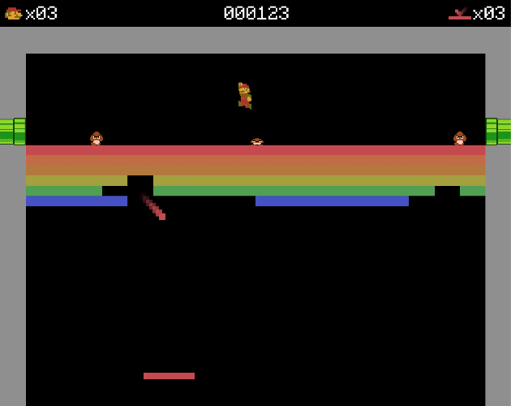

## Mario breaks out

This repo contains the source code of my submission for the [GitHub Game Off 2018](https://itch.io/jam/game-off-2018) game jam.



### How to play?

[Play on itch.io](https://bernhardfritz.itch.io/mario-breaks-out)

### How has this game been implemeted?

This game has been implemented in C++ using my very own library called [piksel](https://bernhardfritz.github.io/piksel/). Essentially, piksel is a graphics library that allows you to target native OS as well as the web. Please refer to the [documentation](https://bernhardfritz.github.io/piksel/) if you would like to learn more about it!

### Build instructions

#### Build natively

```bash
git clone --recursive https://github.com/bernhardfritz/mariobreaksout.git
cd mariobreaksout
mkdir build
cd build
cmake ..
make
./mariobreaksout
```

#### Build for the web

piksel uses Emscripten to compile C++ to WebAssembly. You can install Emscripten by following the [WebAssembly developer's guide](https://webassembly.org/getting-started/developers-guide/).

```bash
git clone --recursive https://github.com/bernhardfritz/mariobreaksout.git
cd mariobreaksout
mkdir build
cd build
emcmake cmake ..
emmake make
emrun --no_browser --port 8080 .
```

<!-- NOTES -->
<!-- montage -background transparent -tile x1 -geometry +0+0 *.png sprites.png -->
<!-- base64 sprites.png -->
